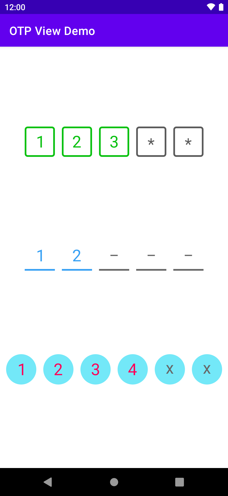

# OTP View

[](https://jitpack.io/#islamhani97/otp-view)

## Description:
OTP View library is a custom view that allows users to enter codes in separate digits to achieve more efficiency for UX.

## Preview Screenshots:


## Dependencies:

### Step 1.
Add the JitPack repository to root build.gradle file.
```Groovy
allprojects {
  repositories {
    // ...
    maven { url 'https://jitpack.io' }
  }
}
```

### Step 2.
Add the dependencies to app module build.gradle file.
```Groovy
dependencies {
  implementation 'com.github.islamhani97:otp-view:latest-version'
}
```

## Usage:

### Step 1.
Create an OTPView view in XML layout.
```xml
<com.islam.android.libraries.otpview.OTPView
        android:id="@+id/otp_view"
        android:layout_width="wrap_content"
        android:layout_height="wrap_content"
        android:textSize="28sp"
        app:digitTextColor="#0AC111"
        app:digitPlaceholder="*"
        app:digitPlaceholderColor="#5B5B5B"
        app:digitsNumber="5"
        app:digitWidth="52dp"
        app:digitHeight="52dp"
        app:digitPadding="12dp"
        app:digitStrokeWidth="3dp"
        app:digitStrokeColor="#5B5B5B"
        app:digitFilledStrokeColor="#0AC111" />
```

#### XML Attributes

- **`app:digitTextColor`** this attribute determines the text color of the digit, it is actually an override for `android:textColor` for some customized modifications,
so, if you set `android:textColor` instead, it won't be applied.<br/>
the default digit text color is **Black**.<br/><br/>
	
- **`app:digitPlaceholder`** it is the placeholder of the digit until it's filled, it should be a single character, otherwise it won't be applied.<br/>
the default digit placeholder is **"\_"**.<br/><br/>
	
- **`app:digitPlaceholderColor`** this attribute determines the color of the placeholder.<br/>
the default digit placeholder color is **Gray**.<br/><br/>
	
- **`app:digitsNumber`** it is the number of digits the code consist of.<br/>
the default number of digits is **six digits**.<br/><br/>
	
- **`app:digitWidth`** **`app:digitHeight`** these two attributes are width and height dimensions digit itself.<br/>
the default dimensions of width and height is **40dp**.<br/><br/>
	
- **`app:digitPadding`** it is the padding space between digits.<br/>
the default padding space is **12dp**.<br/><br/>
	
- **`app:digitStyle`** it is the shape of the digit, it could be `rect` for rectangle shape, `line` for underlined digit, or
`drawable` for custom shape from drawable.<br/>
if you set it as `drawable` you should set `app:digitDrawable` with the custom shape, otherwise it won't be applied.<br/>
the default digit style is **`rect`**.<br/><br/>
	
- **`app:digitDrawable`** this attribute determines the custom shape of the digit from drawable, only if `app:digitStyle` is set as `drawable`,
otherwise it isn't necessary to set this attribute.<br/><br/>
	
- **`app:digitStrokeWidth`** it is the width of digit's stroke, it is only applied when `app:digitStyle` set as `rect` or `line`,
so, if you set `app:digitStyle` as `drawable`, it isn't necessary to set this attribute, which mean it isn't working with custom shapes.<br/>
the default stroke width is **2dp**.<br/><br/>
	
- **`app:digitStrokeColor`** it is the color of digit's stroke, it is only applied when `app:digitStyle` set as `rect` or `line`
so, if you set `app:digitStyle` as `drawable`, it isn't necessary to set this attribute, which mean it isn't working with custom shapes.<br/>
the default color of digit's stroke is **Black**.<br/><br/>

- **`app:digitFilledStrokeColor`** it is the color of filled digit's stroke, it is only applied when `app:digitStyle` set as `rect` or `line`
so, if you set `app:digitStyle` as `drawable`, it isn't necessary to set this attribute, which mean it isn't working with custom shapes.<br/>
the default color of filled digit's stroke matches the color of `app:digitStrokeColor`.<br/><br/>

### Step 2.
After creating an `OTPView` in xml layout, you should get it's reference in your code
and use `setOnCodeCompleteListener()` method to set a listener of type `OTPView.OnCodeCompleteListener`
which has `onCodeComplete()` method which retrieves the code, when it is completely entered.
```Java
OTPView otpView = findViewById(R.id.otp_view);
otpView.setOnCodeCompleteListener(new OTPView.OnCodeCompleteListener() {
    @Override
    public void onCodeComplete(String code) {
        // Do whatever you want to do here
    }
});
```
